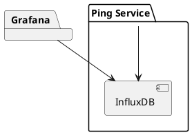
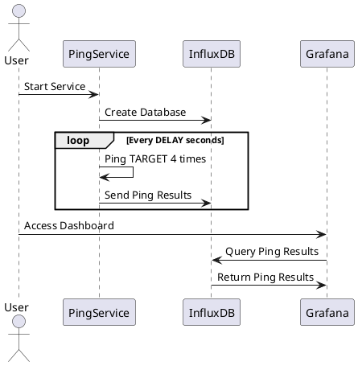

# Ping Microservice

## Overview

This project is a dockerized microservice that performs ICMP pings to a set of
specified IP addresses or URLs at regular intervals and sends the results to an 
InfluxDB database. The results can be visualized using a Grafana dashboard.

## Features

- Ping a target IP address or URL four times at specified intervals.
- Send ping results to InfluxDB.
- Visualize ping results using Grafana.

## Project Structure

```
connection-supervision/
├── Dockerfile
├── Makefile
├── docker-compose.yaml
├── ping_service.py
├── requirements.txt
├── README.md
└── grafana/
└── provisioning/
└── dashboards/
└── ping_dashboard.json
```

## Setup

### Prerequisites

- Docker
- Docker Compose

### Build and Run

1. Build the Docker image:
    ```sh
    make build
    ```

2. Run the services:
    ```sh
    make run
    ```

3. Stop the services:
    ```sh
    make stop
    ```

## Environment Variables

- `DELAY`: Delay in seconds between each set of pings (default is 10 seconds).
- `TARGET`: Target IP address or URL to ping (default is `github.com`).

## Architecture

The architecture consists of the following components:

- **Ping Service**: A Python script that pings a target and sends results to InfluxDB.
- **InfluxDB**: A time-series database to store ping results.
- **Grafana**: A visualization tool to display ping results from InfluxDB.

## Diagrams

### Component Diagram



### Sequence Diagram

